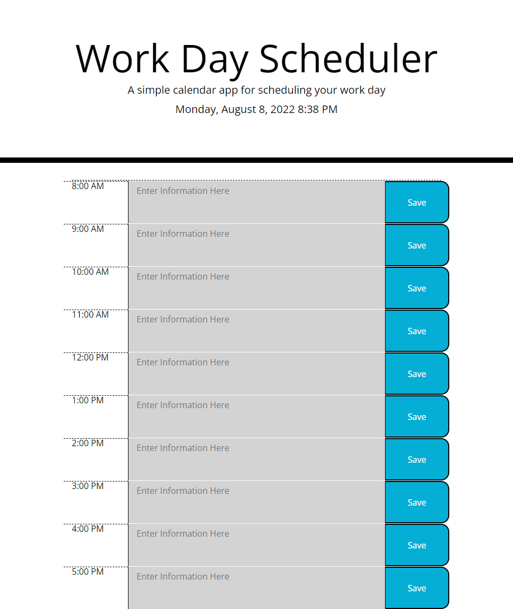

# Work-Day-Scheduler
-Created a simple calendar application that allows a user to save events for each hour of the day. 
-The calender will also display the current date and time.
-The calender will also change the color of the time blocks based on the current time and weather the block are current, in the past, or in the future.
-The inputs that the user saves will display and ramain in the planner after being saved to local storage.

## Screenshot

### Live URL
